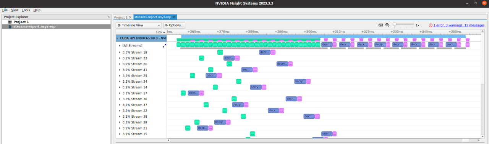

# CUDA-based Encryption/Decryption Application

## Overview

This repository hosts a CUDA-based application designed for encrypting and decrypting large data sets. The application has been optimized using CUDA concurrent streams to achieve concurrent copy and compute operations, which has halved the runtime.

## Key Components

- **`streams.cu`**: Main module that manages encryption and decryption processes using GPU capabilities.
- **`helpers.cuh`**: Utility module that provides support functions such as safe division, CUDA error handling, and file I/O.
- **`encryption.cuh`**: Core cryptographic algorithms module for data processing.

## Performance Profiling

The application's performance has been significantly enhanced by using CUDA concurrent streams. Below is a profiling snapshot that demonstrates the parallel execution of decryption tasks:

  
_Figure: Profiling snapshot showing extensive overlapping of copy/compute operations via concurrent streams._

## Building the Application

The provided Makefile simplifies the build process. To compile the application, use the following make targets:

- **Build the main application:**

  ```bash
  make all
  ```

  or simply

  ```bash
  make
  ```

- **Clean the build:**
  ```bash
  make clean
  ```

## Running the Application

- **Execute the application:**

  ```bash
  ./streams
  ```

- **Profile the application with NVIDIA Nsight Systems:**
  ```bash
  make profile
  ```
  This will generate a detailed performance report named `streams-report.qdrep`, which can be analyzed using NVIDIA Nsight Systems.
